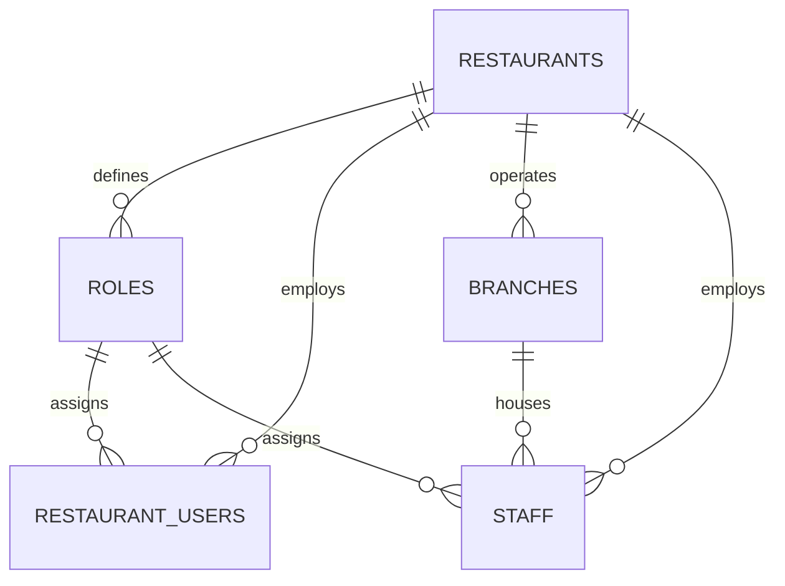

# DATABASE SCHEMA SPECIFICATION — QR Dine SaaS

This document defines the relational database architecture for the multi-tenant QR Dine SaaS operating system. It lists the core operational tables, their attributes, constraints, indexes, and how future features map onto this foundation.

---

## Entity Relationship Diagram (Conceptual)

---

## Detailed Table Reference

### 1. `restaurants` (Root Organization / Tenant)
Defines the tenant properties.

| Field | Type | Constraints | Description |
|-------|------|-------------|-------------|
| `id` | `UUID` | `PRIMARY KEY`, `DEFAULT gen_random_uuid()` | Unique tenant identifier |
| `name` | `TEXT` | `NOT NULL` | Restaurant display name |
| `slug` | `TEXT` | `UNIQUE`, `NOT NULL` | Routing slug (e.g. `acme-donuts`) |
| `logo_url` | `TEXT` | | Brand logo asset url |
| `restaurant_type` | `TEXT` | | Class (e.g. `Fine Dining`, `Food Court`) |
| `phone` | `TEXT` | | Primary contact number |
| `email` | `TEXT` | | Primary contact email |
| `gst_number` | `TEXT` | | Business Tax ID / GST number |
| `currency` | `TEXT` | `NOT NULL`, `DEFAULT 'INR'` | Payment currency code |
| `timezone` | `TEXT` | `NOT NULL`, `DEFAULT 'Asia/Kolkata'` | Operating timezone |
| `status` | `TEXT` | `NOT NULL`, `DEFAULT 'active'`, `CHECK (active, inactive, suspended)` | Operational status |
| `created_at` | `TIMESTAMPTZ` | `NOT NULL`, `DEFAULT now()` | Setup timestamp |
| `updated_at` | `TIMESTAMPTZ` | `NOT NULL`, `DEFAULT now()` | Last edit timestamp |
| `deleted_at` | `TIMESTAMPTZ` | | Soft delete timestamp |

* **Indexes**:
  * `idx_restaurants_slug` on `slug` (Hash/B-tree for fast subdomain routing lookups).
  * `idx_restaurants_status` on `status` (B-tree to filter active accounts).

---

### 2. `roles` (RBAC Definition)
Enables custom permission roles per restaurant tenant.

| Field | Type | Constraints | Description |
|-------|------|-------------|-------------|
| `id` | `UUID` | `PRIMARY KEY` | Role identifier |
| `restaurant_id` | `UUID` | `NOT NULL`, `REFERENCES restaurants(id) ON DELETE CASCADE` | Connected tenant |
| `name` | `TEXT` | `NOT NULL` | Role name (e.g. `Manager`, `Chef`) |
| `description` | `TEXT` | | Role explanation |
| `permissions_json` | `JSONB` | `NOT NULL`, `DEFAULT '{}'` | Key-value permissions mapping |
| `created_at` | `TIMESTAMPTZ` | `NOT NULL`, `DEFAULT now()` | Date added |

* **Indexes**:
  * `idx_roles_restaurant_id` on `restaurant_id` (B-tree for tenant querying).
  * Unique constraint on `(restaurant_id, name)` to prevent role name collisions inside a single restaurant.

---

### 3. `restaurant_users` (Auth Mappings)
Connects authenticated login users (`auth.users`) to specific tenant restaurants.

| Field | Type | Constraints | Description |
|-------|------|-------------|-------------|
| `id` | `UUID` | `PRIMARY KEY` | User association ID |
| `restaurant_id` | `UUID` | `NOT NULL`, `REFERENCES restaurants(id) ON DELETE CASCADE` | Scope to tenant |
| `auth_user_id` | `UUID` | `NOT NULL`, `REFERENCES auth.users(id) ON DELETE CASCADE` | Link to auth system user |
| `role_id` | `UUID` | `REFERENCES roles(id) ON DELETE SET NULL` | Assigned operations role |
| `is_owner` | `BOOLEAN` | `NOT NULL`, `DEFAULT false` | Owner privileges flag |
| `created_at` | `TIMESTAMPTZ` | `NOT NULL`, `DEFAULT now()` | Association date |

* **Indexes**:
  * `idx_restaurant_users_restaurant_id` on `restaurant_id`.
  * `idx_restaurant_users_auth_user_id` on `auth_user_id`.
  * Unique constraint on `(restaurant_id, auth_user_id)` to prevent mapping a user multiple times to the same restaurant.

---

### 4. `branches` (Multiple Locations)
Supports multi-unit franchises operating under a single restaurant tenant.

| Field | Type | Constraints | Description |
|-------|------|-------------|-------------|
| `id` | `UUID` | `PRIMARY KEY` | Branch ID |
| `restaurant_id` | `UUID` | `NOT NULL`, `REFERENCES restaurants(id) ON DELETE CASCADE` | Root tenant |
| `name` | `TEXT` | `NOT NULL` | Branch name (e.g. `Connaught Place Branch`) |
| `branch_code` | `TEXT` | | Optional unique branch code (e.g. `CP-01`) |
| `phone` | `TEXT` | | Branch phone number |
| `email` | `TEXT` | | Branch email |
| `address` | `TEXT` | | Physical address line 1 |
| `address_line2` | `TEXT` | | Physical address line 2 |
| `city` | `TEXT` | | Location City |
| `state` | `TEXT` | | Location State |
| `country` | `TEXT` | | Location Country |
| `postal_code` | `TEXT` | | Zip/Postal code |
| `latitude` | `DECIMAL(9, 6)` | | Geo-coordinate latitude |
| `longitude` | `DECIMAL(9, 6)` | | Geo-coordinate longitude |
| `opening_time` | `TIME` | | Daily opening time |
| `closing_time` | `TIME` | | Daily closing time |
| `business_days` | `JSONB` | `DEFAULT '["Mon",...,"Sun"]'` | Weekly operating days array |
| `timezone` | `TEXT` | `DEFAULT 'Asia/Kolkata'` | Location timezone |
| `is_active` | `BOOLEAN` | `NOT NULL`, `DEFAULT true` | Activity status toggle |
| `is_default` | `BOOLEAN` | `NOT NULL`, `DEFAULT false` | Primary default outlet flag |
| `is_archived` | `BOOLEAN` | `NOT NULL`, `DEFAULT false` | Soft-delete archive flag |
| `created_at` | `TIMESTAMPTZ` | `NOT NULL`, `DEFAULT now()` | Date added |
| `updated_at` | `TIMESTAMPTZ` | `NOT NULL`, `DEFAULT now()` | Last updated |

* **Indexes**:
  * `idx_branches_restaurant_id` on `restaurant_id`.
  * `idx_branches_is_active` on `is_active`.
  * `idx_branches_is_default` on `is_default`.
  * `idx_branches_is_archived` on `is_archived`.
  * `idx_branches_branch_code` on `branch_code`.

---

### 5. `staff` (Operations Personnel)
Lists personnel employed at specific branches, linked to system roles.

| Field | Type | Constraints | Description |
|-------|------|-------------|-------------|
| `id` | `UUID` | `PRIMARY KEY` | Staff ID |
| `restaurant_id` | `UUID` | `NOT NULL`, `REFERENCES restaurants(id) ON DELETE CASCADE` | Scoped tenant |
| `branch_id` | `UUID` | `REFERENCES branches(id) ON DELETE CASCADE` | Assigned branch |
| `role_id` | `UUID` | `REFERENCES roles(id) ON DELETE SET NULL` | Assigned role |
| `full_name` | `TEXT` | `NOT NULL` | Employee full name |
| `phone` | `TEXT` | | Contact phone |
| `email` | `TEXT` | | Contact email |
| `status` | `TEXT` | `NOT NULL`, `DEFAULT 'active'`, `CHECK (active, inactive, suspended)` | Employment status |
| `created_at` | `TIMESTAMPTZ` | `NOT NULL`, `DEFAULT now()` | Hiring date |

* **Indexes**:
  * `idx_staff_restaurant_id` on `restaurant_id`.
  * `idx_staff_branch_id` on `branch_id`.
  * `idx_staff_role_id` on `role_id`.
  * `idx_staff_status` on `status`.

---

## Row-Level Security (RLS) Rules

RLS is configured on all 5 tables to ensure complete tenant isolation:
- **Selects**: Any user mapped to a restaurant inside `restaurant_users` can SELECT records matching that `restaurant_id`.
- **Modifications (INSERT/UPDATE/DELETE)**: Only user records that are flagged as `is_owner = true` for the active `restaurant_id` can modify table rows.
- **Cross-tenant leaks**: All queries must pass through these constraints, making it impossible for Restaurant A to read or write Restaurant B's data, even if an application script forgets a `WHERE` clause.

---

## Future Extension Points (Next Steps)

This relational database foundation is designed to seamlessly integrate upcoming features:

1. **Menu & Categories**: The `categories` and `menu_items` tables will map directly to a `branch_id` or `restaurant_id`, allowing branches to share menus or define branch-specific pricing.
2. **Seating Layouts**: A `tables` table will reference `branch_id`, automatically mapping dining layout codes to unique location endpoints.
3. **Ordering Lifecycle**: The `orders` and `order_items` tables will link to both `table_id` and `branch_id`, scoping kitchen tickets to specific physical branch KDS terminals.
4. **Subscription Billing**: The `restaurants` table will reference subscription plans and billing cycles, allowing for payment deactivation at the root tenant level.
