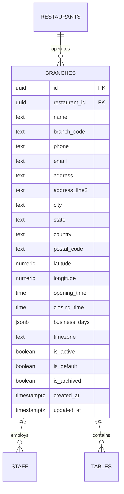

# BRANCH MANAGEMENT MODULE — ARCHITECTURE & REFERENCE

This document details the architecture, data models, security implementation, and operational flows of the **Branch Management Module** in QR Dine SaaS.

---

## 1. Overview

The Branch Management module enables multi-unit restaurant operators to manage single or multiple branch locations under a single parent tenant organization (`restaurants`). It provides complete outlet configuration, geo-coordinate tracking, daily operating hours, business days scheduling, default primary HQ outlet selection, and soft-delete archiving.

---

## 2. Architecture & Data Flow

### Layer Separation
- **Database Schema**: `public.branches` with non-recursive Row-Level Security (RLS) policies scoped via `get_my_restaurant_ids()`.
- **Types**: Extended `Branch`, `CreateBranchPayload`, `UpdateBranchPayload`, `BranchFilterType` in `@qrdine/types`.
- **Services**: `branchService` in `@qrdine/lib/src/services/branch.service.ts`.
- **State & Custom Hook**: `useBranches` in `apps/admin/src/hooks/useBranches.ts`.
- **UI Components**: `BranchCard`, `BranchTableView`, `BranchFormModal`, `BranchDetailsModal`, `BranchArchiveDialog` in `apps/admin/src/components/branches/`.
- **Page Layout**: `BranchesPage` mounted at route `/branches`.

---

## 3. Key Operational Rules & Security

1. **Multi-Tenant Isolation**: Every database operation (query, insert, update, archive, delete) strictly enforces `restaurant_id = tenantId`.
2. **Soft-Delete Archiving**: Outlets can be archived (`is_archived = true`, `is_active = false`) to preserve historic records.
3. **Permanent Deletion**: Outlets can be permanently deleted from the database using the hard-delete action with name confirmation (`deleteBranch`).
4. **Primary Default Outlet Protection**:
   - The primary default branch (`is_default = true`) cannot be deactivated, archived, or permanently deleted until another branch is designated as the primary default.
   - A restaurant must always maintain at least one branch outlet.
5. **Branch Switcher**: Integrated into `AuthContext` and topbar header (`DashboardLayout`).

---

## 4. Files Summary

### Files Created & Updated
- `insforge/migrations/009_add_branch_fields.sql` — Schema migration for extended branch columns & indexes.
- `packages/lib/src/services/branch.service.ts` — Tenant-isolated branch CRUD, default assignment, archiving, permanent delete, and metrics.
- `apps/admin/src/hooks/useBranches.ts` — State hook managing branch lists, filtering, searching, archiving, and deletion.
- `apps/admin/src/components/branches/BranchCard.tsx` — Glassmorphism outlet summary card component with archive and delete buttons.
- `apps/admin/src/components/branches/BranchTableView.tsx` — High-density tabular branch view component with action triggers.
- `apps/admin/src/components/branches/BranchFormModal.tsx` — Professional 3-step modal form wizard for creation and editing.
- `apps/admin/src/components/branches/BranchDetailsModal.tsx` — Modal view showing complete location metadata and operational counts.
- `apps/admin/src/components/branches/BranchArchiveDialog.tsx` — Soft-delete archive confirmation warning modal.
- `apps/admin/src/components/branches/BranchDeleteDialog.tsx` — Permanent deletion modal with explicit branch name confirmation.
- `apps/admin/src/pages/BranchesPage.tsx` — Main Branch Management console page.
- `docs/BRANCH_MANAGEMENT_MODULE.md` — This documentation file.

### Files Modified
- `packages/types/src/index.ts` — Extended `Branch` interface and payload types.
- `packages/lib/src/index.ts` — Re-exported `branch.service.ts`.
- `apps/admin/src/contexts/AuthContext.tsx` — Integrated non-archived branch resolution & default selection.
- `apps/admin/src/layouts/DashboardLayout.tsx` — Enhanced Topbar Branch Selector dropdown.
- `apps/admin/src/App.tsx` — Mounted `/branches` route to `BranchesPage`.
- `DATABASE_SCHEMA.md` — Updated database reference documentation.

---

## 5. Future Multi-Branch Extensions
- **Multi-Branch Inventory & Menu Overrides**: Branch-level menu item pricing and availability overrides.
- **Geofenced Customer Ordering**: Customer app matching table scans to nearest latitude/longitude branch coordinates.
- **KDS Routing**: Live order ticket routing to specific branch kitchen displays.
