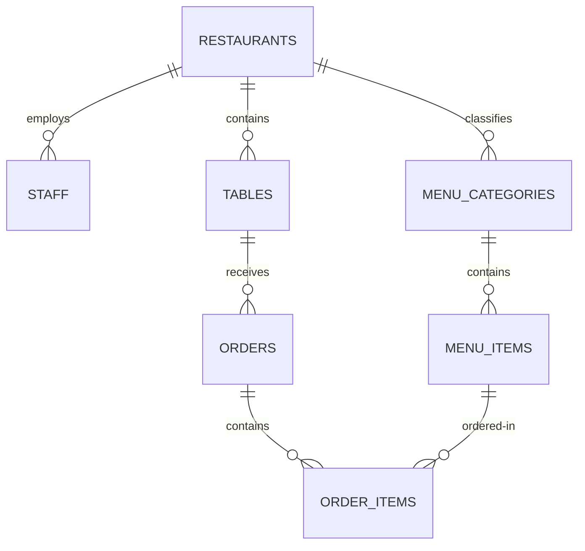

# DATABASE SPECIFICATION — QR Dine SaaS

The QR Dine SaaS platform uses a single PostgreSQL database powered by InsForge BaaS. Tenant isolation is enforced natively at the database level using PostgreSQL **Row-Level Security (RLS)**.

---

## Entity Relationship Diagram (Conceptual)



---

## Database Schemas

### 1. `restaurants` (Tenant)
Stores the root organization settings and metadata.

| Column | Type | Constraints | Description |
|--------|------|-------------|-------------|
| `id` | `UUID` | `PRIMARY KEY`, `DEFAULT gen_random_uuid()` | Unique restaurant ID |
| `owner_id` | `UUID` | `NOT NULL`, `REFERENCES auth.users(id)` | Reference to owning auth user |
| `name` | `TEXT` | `NOT NULL` | Display name of the restaurant |
| `slug` | `TEXT` | `UNIQUE`, `NOT NULL` | Subdomain slug (e.g. `acme-pizza`) |
| `description` | `TEXT` | `NULL` | Bio or taglines |
| `logo_url` | `TEXT` | `NULL` | Restaurant brand logo image url |
| `cover_image_url` | `TEXT` | `NULL` | Main cover banner image url |
| `address` | `TEXT` | `NULL` | Street address |
| `phone` | `TEXT` | `NULL` | Business phone line |
| `currency` | `TEXT` | `NOT NULL`, `DEFAULT 'INR'` | Default currency code |
| `timezone` | `TEXT` | `NOT NULL`, `DEFAULT 'Asia/Kolkata'` | Default timezone string |
| `settings` | `JSONB` | `NOT NULL`, `DEFAULT '{}'` | Custom color tokens, operating hours, tax |
| `is_active` | `BOOLEAN` | `NOT NULL`, `DEFAULT true` | Activity status |
| `created_at` | `TIMESTAMPTZ` | `NOT NULL`, `DEFAULT now()` | Creation timestamp |
| `updated_at` | `TIMESTAMPTZ` | `NOT NULL`, `DEFAULT now()` | Last update timestamp |

### 2. `staff` (RBAC mapping)
Maps authenticated users to specific tenant restaurants.

| Column | Type | Constraints | Description |
|--------|------|-------------|-------------|
| `id` | `UUID` | `PRIMARY KEY`, `DEFAULT gen_random_uuid()` | Staff mapping ID |
| `restaurant_id` | `UUID` | `NOT NULL`, `REFERENCES restaurants(id) ON DELETE CASCADE` | Connected restaurant |
| `user_id` | `UUID` | `NOT NULL`, `REFERENCES auth.users(id) ON DELETE CASCADE` | Connected auth user |
| `role` | `TEXT` | `NOT NULL`, `CHECK (role IN ('owner','manager','staff','kitchen'))` | User's operations role |
| `name` | `TEXT` | `NOT NULL` | Display name of staff member |
| `is_active` | `BOOLEAN` | `NOT NULL`, `DEFAULT true` | Activity status |
| `created_at` | `TIMESTAMPTZ` | `NOT NULL`, `DEFAULT now()` | Date added |

### 3. `menu_categories`
Organizes menu items within a restaurant.

| Column | Type | Constraints | Description |
|--------|------|-------------|-------------|
| `id` | `UUID` | `PRIMARY KEY` | Category ID |
| `restaurant_id` | `UUID` | `NOT NULL`, `REFERENCES restaurants(id) ON DELETE CASCADE` | Scope to tenant |
| `name` | `TEXT` | `NOT NULL` | e.g. "Starters", "Desserts" |
| `description` | `TEXT` | `NULL` | Optional details |
| `sort_order` | `INT` | `NOT NULL`, `DEFAULT 0` | Ordering hierarchy index |
| `is_active` | `BOOLEAN` | `NOT NULL`, `DEFAULT true` | Active flag |

### 4. `menu_items`
Indivdual foods/beverages.

| Column | Type | Constraints | Description |
|--------|------|-------------|-------------|
| `id` | `UUID` | `PRIMARY KEY` | Item ID |
| `restaurant_id` | `UUID` | `NOT NULL`, `REFERENCES restaurants(id) ON DELETE CASCADE` | Scope to tenant |
| `category_id` | `UUID` | `NOT NULL`, `REFERENCES menu_categories(id) ON DELETE CASCADE` | Category reference |
| `name` | `TEXT` | `NOT NULL` | Dish name |
| `description` | `TEXT` | `NULL` | Ingredients, size details |
| `price` | `DECIMAL` | `NOT NULL` | Cost value |
| `image_url` | `TEXT` | `NULL` | Dish photo |
| `is_available` | `BOOLEAN` | `NOT NULL`, `DEFAULT true` | Out-of-stock toggle |
| `is_veg` | `BOOLEAN` | `NOT NULL`, `DEFAULT false` | Veg classification indicator |
| `allergens` | `TEXT[]` | `DEFAULT '{}'` | Array of allergens (e.g. `{'nuts','dairy'}`) |
| `preparation_time` | `INT` | `NULL` | Average cook time (minutes) |
| `sort_order` | `INT` | `NOT NULL`, `DEFAULT 0` | Ordering index |

### 5. `tables`
Dine-in tables representing physical seating areas.

| Column | Type | Constraints | Description |
|--------|------|-------------|-------------|
| `id` | `UUID` | `PRIMARY KEY` | Table ID |
| `restaurant_id` | `UUID` | `NOT NULL`, `REFERENCES restaurants(id) ON DELETE CASCADE` | Scope to tenant |
| `table_number` | `INT` | `NOT NULL` | Seating number |
| `label` | `TEXT` | `NULL` | e.g. "Terrace 2" |
| `capacity` | `INT` | `NOT NULL`, `DEFAULT 4` | Seating capacity |
| `qr_code_url` | `TEXT` | `NULL` | S3 URL for printable code |
| `status` | `TEXT` | `NOT NULL`, `CHECK IN ('available','occupied','reserved','inactive')` | Table state |

### 6. `orders` & `order_items`
Customer transactional order details.

#### `orders` (Headers)
- `id` (UUID, Primary Key)
- `restaurant_id` (UUID, Foreign Key)
- `table_id` (UUID, Foreign Key)
- `customer_name` (Text, Nullable)
- `status` (Text, Check Constraint: `pending`, `confirmed`, `preparing`, `ready`, `served`, `cancelled`)
- `total_amount` (Decimal)
- `notes` (Text, Nullable)
- `created_at` / `updated_at` (Timestamptz)

#### `order_items` (Lines)
- `id` (UUID, Primary Key)
- `order_id` (UUID, Foreign Key ON DELETE CASCADE)
- `restaurant_id` (UUID, Foreign Key)
- `menu_item_id` (UUID, Foreign Key)
- `quantity` (Int, Default 1)
- `unit_price` (Decimal)
- `notes` (Text, Nullable)
- `status` (Text, Check: `pending`, `preparing`, `ready`, `served`)

---

## Row-Level Security (RLS) & Multi-Tenancy

Every tenant-scoped table features a `restaurant_id` column. Security rules are configured in [006_create_rls_policies.sql](file:///c:/Users/Inayath%20shariff/Downloads/restaurant%20software/insforge/migrations/006_create_rls_policies.sql):

1. **Write Operations**: Admin dashboard staff only have permission to execute commands where the target record's `restaurant_id` matches their own `restaurant_id` as retrieved from the `staff` directory table for `auth.uid()`.
2. **Read Operations**: Customers can read tables, categories, and items unconditionally (enabling QR scanning menu displays), but can only write orders/order_items. They can only view their own order lines by matching order IDs.

### RLS Scoped Policy template (Postgres):
```sql
CREATE POLICY tenant_isolation_policy ON public.some_table
  FOR ALL
  USING (
    restaurant_id IN (
      SELECT restaurant_id FROM public.staff
      WHERE user_id = auth.uid() AND is_active = true
    )
  );
```

---

## Indexing Strategy
To optimize subsecond lookup times across millions of records:
- **Leftmost tenant indexing**: Every composite index begins with `restaurant_id`.
- **Menu order queries**: Indexed on `(restaurant_id, category_id, sort_order)` to fetch sorted categories and items instantly.
- **Table scans**: Index on `(restaurant_id, table_number)` for single-lookup table resolution during QR scans.
- **Date ranges**: Indexed on `(restaurant_id, created_at DESC)` to query active daily revenue metrics.
