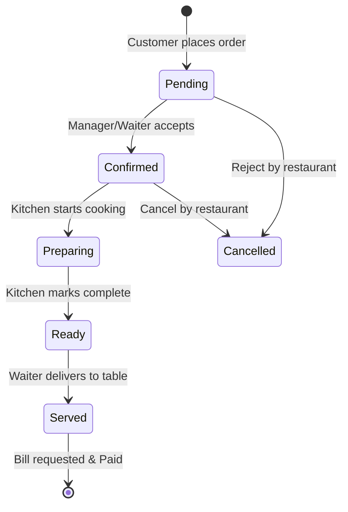

# ORDER LIFECYCLE FLOW — QR Dine SaaS

This document traces the complete lifecycle of a customer order, starting from the physical QR scan at a restaurant table to the kitchen KDS display, billing request, and final payment fulfillment.

---

## Order State Transitions

---

## Step-by-Step Flow

### 1. Seating & QR Scan
- **Trigger**: Customer sits at a table and scans the physical QR code.
- **Link**: Resolves to the customer app url: `https://qrdine.com/r/:restaurantSlug/t/:tableId`.
- **System Action**: The app reads `restaurantSlug` and `tableId` from the route params, fetches the active restaurant profile and menu categories, and loads them on the screen.

### 2. Browsing & Cart Addition
- **Trigger**: Customer browses items, selects variants/options, and adds them to their cart.
- **System Action**: The cart state is managed in the client session via `CartProvider` using React Context. Items are stored in `sessionStorage` to survive page reloads.

### 3. Placing the Order (Checkout)
- **Trigger**: Customer clicks "Place Order" and enters their name (optional).
- **System Action**:
  - The app calls `orderService.createOrder()` with the cart payload.
  - The API performs a transactional insert:
    1. Inserts a row into the `orders` table (status set to `pending`).
    2. Inserts rows into the `order_items` table referencing the order.
  - On successful insert, the database trigger `trigger_new_order_placed` fires, issuing a `pg_notify` event:
    - Channel: `kitchen:{restaurant_id}`
    - Event: `new_ticket`

### 4. Kitchen Notification (KDS)
- **Trigger**: The Kitchen Display App is running at the counter, subscribed to the `kitchen:{restaurant_id}` realtime channel.
- **System Action**:
  - The socket receives the `new_ticket` broadcast event.
  - The KDS updates its Kanban board column, playing an alert chime for the kitchen staff.
  - An order ticket card is rendered, displaying item details, special preparation notes, and an active timer.

### 5. Order Progression
- **Preparation Start**:
  - Kitchen staff click "Start" on the ticket.
  - KDS calls `orderService.updateOrderStatus(orderId, 'preparing')`.
  - Database trigger fires, notifying the customer status screen via channel `order:{order_id}` (Event: `order_status_update`). The customer sees the visual timeline progress to "Preparing".
- **Preparation Complete**:
  - Kitchen staff click "Ready".
  - KDS calls `orderService.updateOrderStatus(orderId, 'ready')`.
  - The customer is notified ("Your order is ready!"). Waiter picks up the tray.
- **Served**:
  - Waiter delivers food and marks the ticket as served.
  - Order status updates to `served`.

### 6. Bill Request & Payment (Future)
- **Trigger**: Customer clicks "Request Bill" on their phone.
- **System Action**:
  - Notifies staff via the `orders:{restaurant_id}` channel.
  - Waiter prints the receipt. Payment is processed (digital gateway or cash), and the table status is reset to `'available'`.
